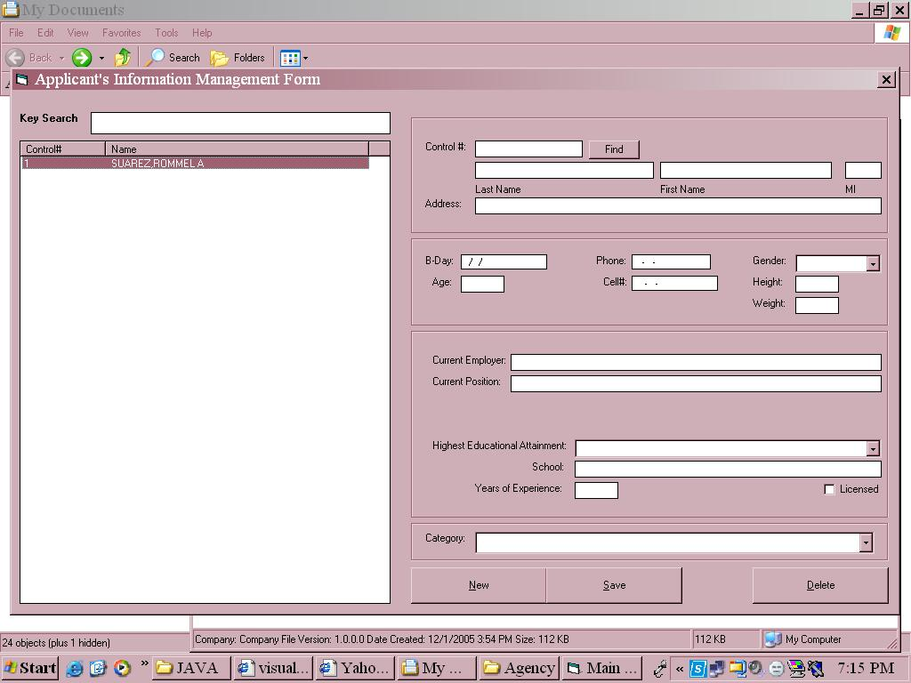



## ADO Programming

### Description

A simple application which shows how to call and manipulate Access Database records through ADO using Visual basic. Also, shows the proper GUI design for a transaction application.

Please Rate :)....
 
### More Info
 

             |
---                |---
**Submitted On**   |2005-12-01 15:52:42
**By**             |[Rommel A\. Suarez](https://github.com/Planet-Source-Code/PSCIndex/blob/master/ByAuthor/rommel-a-suarez.md)
**Level**          |Beginner
**User Rating**    |5.0 (15 globes from 3 users)
**Compatibility**  |VB 3\.0, VB 4\.0 \(16\-bit\), VB 4\.0 \(32\-bit\), VB 5\.0, VB 6\.0
**Category**       |[Databases/ Data Access/ DAO/ ADO](https://github.com/Planet-Source-Code/PSCIndex/blob/master/ByCategory/databases-data-access-dao-ado__1-6.md)
**World**          |[Visual Basic](https://github.com/Planet-Source-Code/PSCIndex/blob/master/ByWorld/visual-basic.md)
**Archive File**   |[ADO\_Progra1953971252005\.zip](https://github.com/Planet-Source-Code/rommel-a-suarez-ado-programming__1-63517/archive/master.zip)

